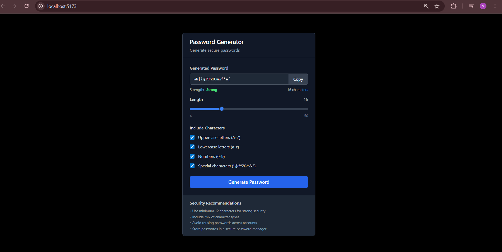

<body>

  <h1>🔐 Password Generator</h1>
  
A professional, secure password generator built with React that creates cryptographically strong passwords with customizable options.

  

    <h2>🚀 Features</h2>
    <ul>
      <li><strong>Cryptographically Secure</strong>: Uses <code>crypto.getRandomValues()</code> for true randomness</li>
      <li><strong>Customizable Length</strong>: Generate passwords from 4 to 50 characters</li>
      <li><strong>Character Type Options:</strong>
        <ul>
          <li>Uppercase letters (A-Z)</li>
          <li>Lowercase letters (a-z)</li>
          <li>Numbers (0-9)</li>
          <li>Special characters (!@#$%^&amp;*)</li>
        </ul>
      </li>
      <li><strong>Password Strength Indicator</strong>: Real-time strength analysis (Weak/Fair/Good/Strong)</li>
      <li><strong>One-Click Copy</strong>: Copy generated passwords to clipboard instantly</li>
      <li><strong>Professional UI</strong>: Clean, enterprise-grade interface</li>
      <li><strong>Responsive Design</strong>: Works perfectly on desktop and mobile devices</li>
    </ul>
  

  

    <h2>🎥 Demo</h2>
    
Screenshot of the working app:

    
  

  

    <h2>📦 Installation</h2>
    
Clone the repository:

    <pre><code>git clone https://github.com/yourusername/password-generator.git
cd password-generator</code></pre>

    
Install dependencies:

    <pre><code>npm install</code></pre>

    
Start the development server:

    <pre><code>npm start</code></pre>

    
Open <a href="http://localhost:3000" target="_blank">http://localhost:3000</a> to view it in your browser.

  

  

    <h2>🧑‍💻 Usage</h2>
    <ul>
      <li><strong>Set Password Length</strong>: Use the slider to choose password length (4-50 characters)</li>
      <li><strong>Select Character Types</strong>: Check/uncheck boxes to include different character sets</li>
      <li><strong>Generate Password</strong>: Click "Generate Password" button</li>
      <li><strong>Copy Password</strong>: Click "Copy" button to copy it to clipboard</li>
      <li><strong>Check Strength</strong>: View real-time strength indicator</li>
    </ul>
  

  

    <h2>🛠 Technologies Used</h2>
    <ul>
      <li>React - Frontend framework</li>
      <li>Tailwind CSS - Styling and responsive design</li>
      <li>Crypto Web API - Secure random number generation</li>
      <li>React Hooks - State management (<code>useState</code>, <code>useCallback</code>, <code>useEffect</code>, <code>useRef</code>)</li>
    </ul>
  

  

    <h2>🛡️ Security Features</h2>
    <ul>
      <li>Cryptographically secure password generation</li>
      <li>No password storage or transmission</li>
      <li>All logic runs entirely in the browser (client-side)</li>
      <li>Entropy-based strength calculation</li>
      <li>Interface provides security best-practice tips</li>
    </ul>
  

  

    <h2>📁 Code Structure</h2>
    <pre><code>src/
├── App.js          # Main component with password generation logic
├── index.js        # React entry point
└── index.css       # Global styles</code></pre>
  

  

    <h2>🔑 Key Functions</h2>
    <ul>
      <li><code>passwordGenerator()</code> - Generates secure passwords using <code>crypto.getRandomValues()</code></li>
      <li><code>calculateStrength()</code> - Analyzes password strength based on length and variety</li>
      <li><code>copyPasswordToClipboard()</code> - Copies password to clipboard with feedback</li>
    </ul>
  

  

    <h2>🌐 Browser Support</h2>
    <ul>
      <li>Chrome 11+</li>
      <li>Firefox 21+</li>
      <li>Safari 6.1+</li>
      <li>Edge 12+</li>
      <li>All modern browsers supporting Crypto API</li>
    </ul>
  

  

    <h2>🤝 Contributing</h2>
    <ol>
      <li>Fork the repository</li>
      <li>Create your feature branch: <code>git checkout -b feature/AmazingFeature</code></li>
      <li>Commit your changes: <code>git commit -m 'Add some AmazingFeature'</code></li>
      <li>Push to the branch: <code>git push origin feature/AmazingFeature</code></li>
      <li>Open a Pull Request</li>
    </ol>
  

  

    <h2>🚧 Future Enhancements</h2>
    <ul>
      <li>Password complexity rules customization</li>
      <li>Bulk password generation</li>
      <li>Export passwords to file</li>
      <li>Password pronunciation guide</li>
      <li>Dark/Light theme toggle</li>
      <li>Password templates (pronounceable, PIN, etc.)</li>
    </ul>
  

 

  

    <h2>📢 Acknowledgments</h2>
    <ul>
      <li>Built with React and modern web technologies</li>
      <li>Inspired by enterprise security best practices</li>
      <li>Designed for both professional and personal use</li>
    </ul>
  

  

    <h2>📬 Contact</h2>
    
<strong>Your Name:</strong> Vinay J

    
<strong>Email:</strong> vinay1571h@gmail.com

    
⭐ Star this repository if you found it helpful!

  

</body>
